# Cheesy Cheese
Idea of this website to give something special to the community who love cheese alot. So, I decided to make a website with the recipes of some tasty, delicius and famous food made from cheese or used cheese as its main ingredient.
## Features

## Existing Features
### Header/Nav Bar
    Website is having a static header element with logo on the left side of the desktop page and nav bar hanging against it on the left hand side.
    nav bar elements are hilighted by showing a border underneath it when the particular navbar element id hovered, plus the current nav link is highlighted for the current active page.
    These properties and looks of the header and navbar are consistant throughout the website.
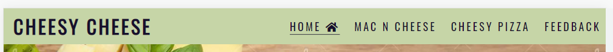

    Navigation links move under the logo for screen sizes 950px and smaller (for tablets)
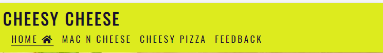

    It further changes its position for screen sizes 800px and smaller (for smart phones)
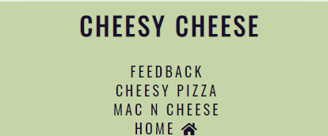

    All pages of the website has a hero image underneath the header and navbar area with cover text on it saying what is the website about, which changes its position on screen smaller than 950px.
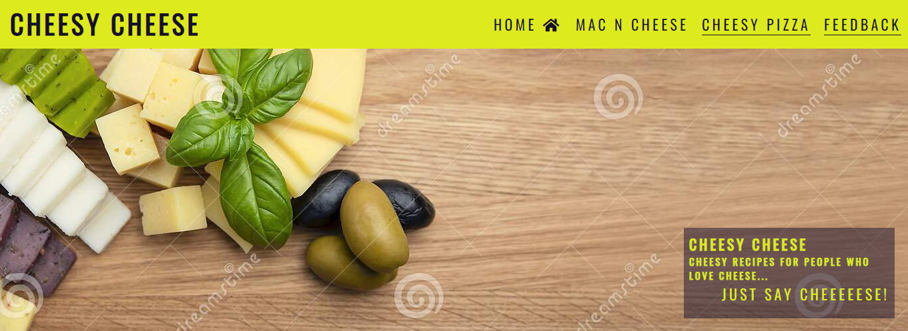
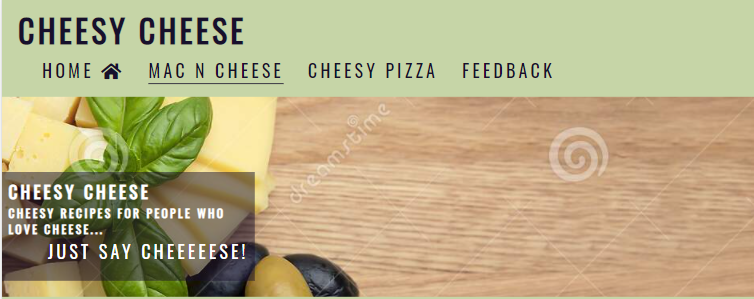
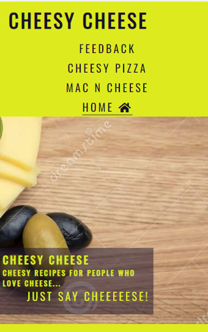

The logo, nav bar and hero image on the top and footer at the bottom is consistent to all the pages. Content changes between those areas. 

### Landing Page

On home page, under the hero image has some text including some facts about cheese and why people think it is amazing, what actually cheese is and what is the origin of cheese? It has an picture on the right hand side of the text. 

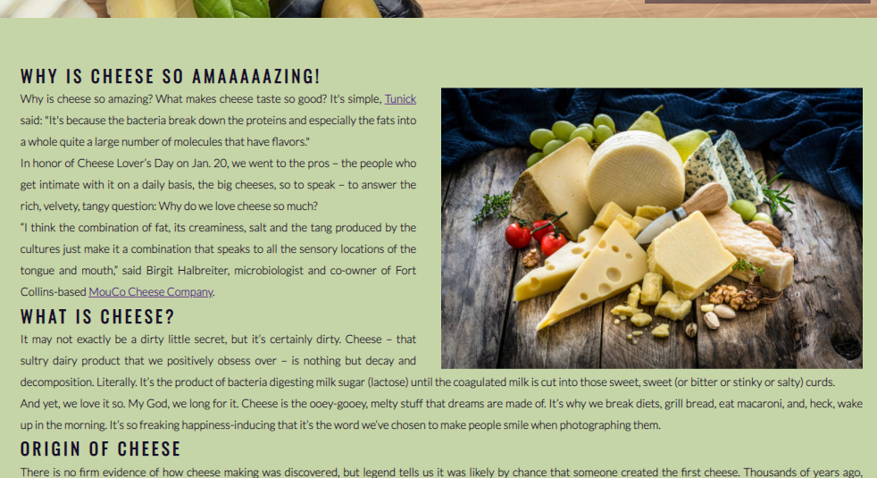

This picture shifts as sctreen size goes down.

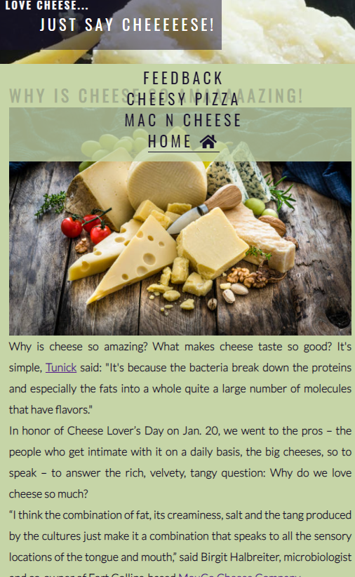

### Recipe Pages
    There are currently 2 recipe pages available, Mac n Cheese and Cheesy Pizza.
    These recipe pages have same header and footer layout, instead of body text these have list on ingredients and procedure of cooking the specific food.

    Lay out of the recipe pages are similar to each other. Both has Ingredients and Method of cooking the dish with a image of the cooked dish beside it. It is responsive to smaller screen sizes.

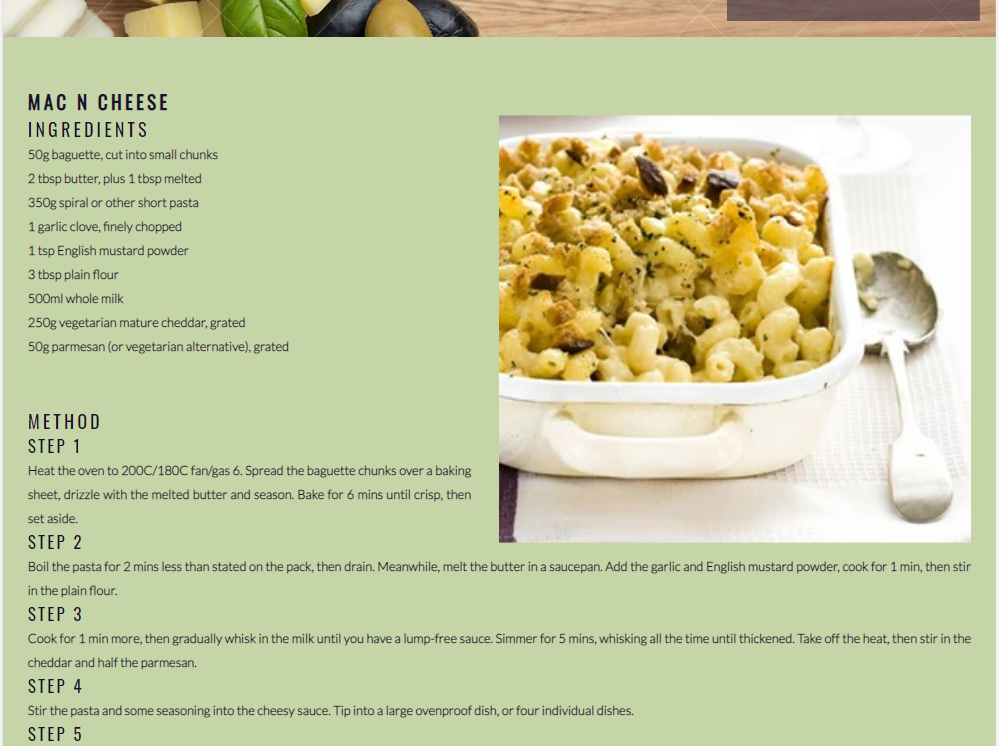

### Footer

Footer contains social media icons which are linked to the corresponding external websites and it cover 100% of the screen width on all screen sizes. Aria label attribute is used for all the external links to communicate the text to screen reader users. 

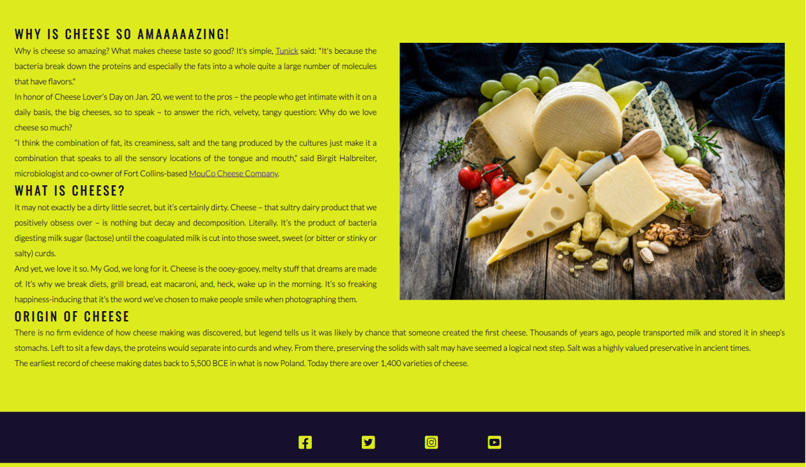
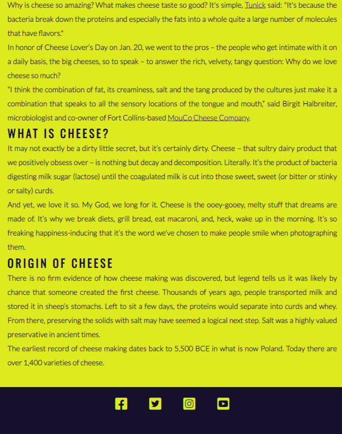

### Feedback Page

## Features Left to Implement

## Testing

## Validator Testing

## Unfixed Bugs

# Deployment

## Credits
This project is built for studies purpose only.
<ul>
    <li>Image used as hero image is downloaded from megapixel.com</li>
    <li>Rest of the images on the main page and recipe pages are downloaded from istockphoto.com </li>
    <li>All recipes were copied from bbcgoodfood.com</li>
</ul>
    
### Content

### media

## Other General Project Advice