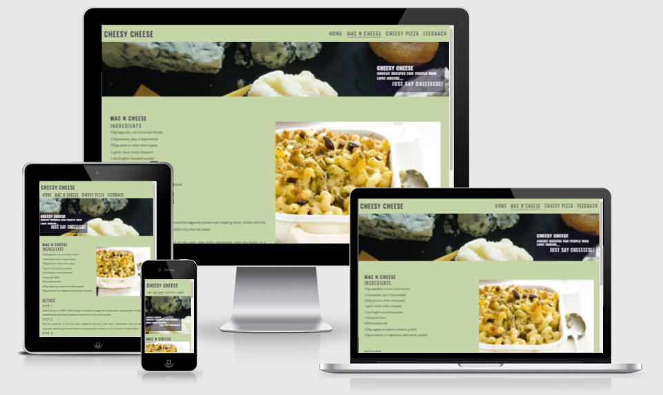
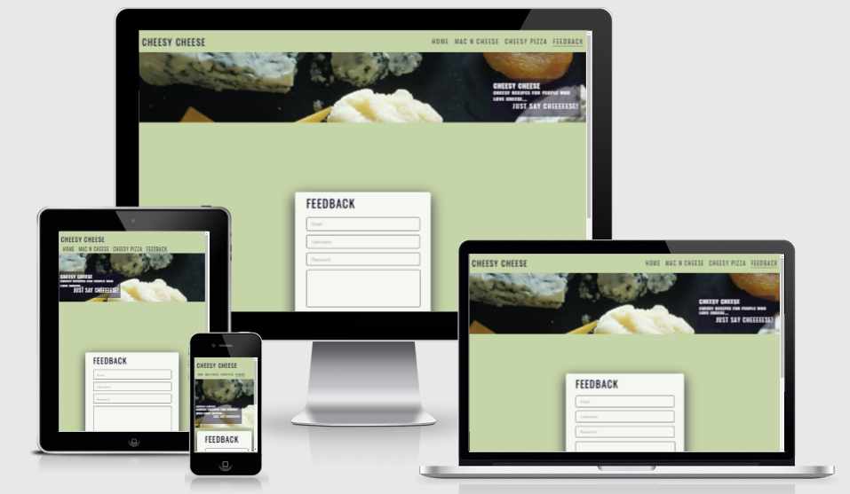

# **Cheesy Cheese**
## Overview

Idea of this website to give something special to the community who love cheese so much that they can't live without it. There are already website for recipes including recipes of food with cheese in it. But I decided to make a website with the recipes of tasty, delicius and famous food made from cheese or used cheese as its main ingredient. It means **every recipes in this website has cheese in it as its main ingredient**.

Many people around the world love cheese and food made from cheese, even some on them use it as their regular part of daily meal. Kids love food with cheese in it and they always want something cheesy. It is a good idea to have them all in one place for their mommies. So, they don't need to go to website and look for cheesy recipes, as these are all cheesy in this website.
    

## Table of contents 
* [Cheesy Cheese](#cheesy-cheese)
    * [User Goals](#user-goals)
    * [User Stories](#user-stories)
    * [User Requirements and Expectations](#user-requirements-and-expectations)
        * [Requirements](#requirements)
        * [Expectations](#expectations)
    * [Design Choices](#design-choices)
        * [Fonts](#fonts)
        * [Icons](#icons)
        * [Colors](#colors)
* [Wireframes](#wireframes)
* [Features](#features)
    * [Header and Navbar](#header-and-navbar)
    * [Landing Page](#landing-page)
    * [Recipe Page](#recipe-page)
    * [Footer](#footer)
    * [Feedback Page](#feedback-page)
    * [Thank You Page](#thank-you-page)
* [Technologies Used](#technologies-used)
    * [Languages](#languages)
    * [Tools](#tools)
* [Testing](#testing)
    * [Physical Testing](#physical-testing)
    * [Validator Testing](#validator-testing)
    * [Fixed Bugs](#fixed-bugs)
* [Deployment](#deployment)
* [Credits](#credits)
    * [Content](#content)
    * [Media](#media)
    * [Other Sources](#other-sources)

## User Goals

* Website should be easy to navigate on all devices formats such as desktop, tablets and mobile phones.
* Visually pleasing.
* Provide users good quality content.
* Should have other useful information regarding the main ingredient.
* Easy to follow recipes.

[Back to Top](#table-of-contents)

## User Stories

* I want to see easy to follow recipes, without any amiguity.
* I would like to see the image of the cooked food, following the recipe.
* I should be able to give feedback. So, I can give any suggestions I have.
* I would like to find some interesting facts in the website.
* It should look professionally designed.

[Back to Top](#table-of-contents)

## User Requirements and Expectations

### Requirements

* Easy to navigate.
* Easy to read and follow the instructions.
* To have a simple Feedback form.

### Expectations

* When clicking on external link, I expect the page to open in a new window.
* After submitting the feedback, there should be a message delivered to confirm the feedback submission.

[Back to Top](#table-of-contents)

## Design Choices

### Fonts

I have used Google fonts to find the desired font styles from this project and have decided to use font **'Lato' and 'Oswald'**. These two font styles complement each other very well.

I used Oswald font style for the headings. Oswald makes the headings clear and nice to look at. 

For the body content and recipes and forms, I used Lato font. It make the website very easy to read.

### Icons

I have used all the icons in the footer from the **[Font Awesome library](https://fontawesome.com/ "Font Awesome")**.

### Colors

I used a colour similar to **navy** *rgb(23, 16, 44)* for the all the texts and heading to give a uniformity throughout the website and used a similar to **light pistachio** *rgb(198, 213, 167)* colour for the background to give a good contrast between the text and the background, which makes it easy to read.

[Back to Top](#table-of-contents)

## Features
### **Header and Navbar**

Website has a static header element with logo on the left side of the desktop page.

Navigation bar elements are increase in size when the particular navbar element is hovered, plus the nav link is underlined for the current active page.
    
These properties and **looks of the header and navbar are consistant throughout the website**.

Nav bar hanging against the logo on the right hand side, but it chages its position for smaller screen it moves under the logo for screen sizes 950px and smaller (for tablets). It reduces its font size for screen sizes 600px and smaller (for smart phones/ tablets in portrait mode).

All pages of the website has a hero image with text overlay underneath the header and navbar area with cover text on it saying what is the website about, which changes its position on screen smaller than 950px.

The logo and nav bar link items have sticky position. These stay on the top of the screen, even when user is scrolling down.

[Back to Top](#table-of-contents)

### **Landing Page**

On home page, under the hero image it has some text including some facts about cheese and why people think it is amazing, what actually cheese is and what is the origin of cheese? It has an picture on the right hand side of the text, which takes over 100% of the width when screen size is reduced to 600 pixels or less.

[Back to Top](#table-of-contents)

### **Recipe Page**

There are currently 2 recipe pages available, Mac n Cheese and Cheesy Pizza. These recipe pages have same header and footer layout, instead of body text these have list on ingredients and procedure of cooking the specific food.

Lay out of the recipe pages are similar to each other. Both has Ingredients and Method of cooking the dish with a image of the cooked dish beside it. It is responsive to smaller screen sizes same as the home page and images take over 100% of the screen width for 600px or smaller screen sizes.

[Back to Top](#table-of-contents)

### **Footer**

Footer contains social media icons which are linked to the corresponding external websites and it cover 100% of the screen width on all screen sizes. **Aria label attribute is used for all the external links to communicate the text to screen reader users**. 

[Back to Top](#table-of-contents)

### **Feedback Page**

Feedback page was designed to get cusotmer login and their feedback about the website, get the new ideas from the target audience.
It validates user's input. User's email address, username and password are required fields form instruct user to input all those fields before it can be submitted. Moreover, I validates the proper email syntax and incripts the password content.

[Back to Top](#table-of-contents)

### **Thank You Page**

This page was created to thank users for taking their time to fill up the feedback form and to give them confirmation that their feedback has been validly entered.
The box height and width gains in size to accomodate the text on the smaller screens.

[Back to Top](#table-of-contents)

## Technologies Used
### Languages

As I am doing HTML/CSS project, I used only HTML5 and CSS3 throughout the project.
I used media query to make the website responsive to different screen sizes.

### Tools

I used gitpod IDE to code my website.

I deployed it on the github pages, which is easy to manage and update in future.

[Back to Top](#table-of-contents)

## Testing

### Physical Testing

This website is tested on **Google Chrome, Microsoft Edge and Mozilla Firefox**.

it was tested on a **Huawei P30 android phone** for mobile screen responsiveness.

It is responsive for different screen sizes, which is checked on all above mentioned internet browsers, phone screen.

The colour scheme used in the website is readable on all screens and browsers. 

Forms are tested, it validates the input for different fields and submit button responds.

Clicking on submit button, if form is validated, brings user to the thankyou page.

[Back to Top](#table-of-contents)

### Validator Testing

No errors were detected by W3C validatol for all html files.

No issues were indicated by W3C CSS (Jigsaw) validator for css file.

I confirmed that colours and fonts are readable.

I used lighthouse option the Google Chrome Dev Tools to verify the website integrity. Folowing is the screenshot of the report I got from lighthouse. 
    

[Back to Top](#table-of-contents)

## Fixed Bugs

I have a sticky header and navbar, situated side by side on the top of the each page of the site. On the smaller screens navbar moves under the logo creating another row. For the mobile screens navbar used to go under logo but the navbar items were stacked on top of each other and it was covering almost half of the screen. I fixed if by reducing the font of the navbar item, so these can fit on onle row under the logo.

The sticky header and navbar had another issue that when I was scrolling down it was staying on the top of all the items except hero image. I used z-index on the header area and hero image and gave the one for header area higher value than the one for the hero image to solve the issue.

[Back to Top](#table-of-contents)

## Deployment

- I deployed my website through <a href="https://github.com/" target="_blank">GitHub.com</a>.

- I started by logging in to my own account and clicked on "your repositories" link in the my account menu. 

- I clicked my project repository, it opened another page with all ny files I created for the project. 

- On top of the screen just above the list of file there is a menu. 

- Next, I clicked the setting option on the right hand of the menu, which brings to the setting page. 

- I scrolled down untill I find GitHub Pages option. 

- Then I clicked "check it out here" link under it to open Github Pages full menu page and it said that my site was published at the web address.

You can check out my GitHub repository by clicking <a href="https://github.com/kazcare/cheesy-cheese" target="_blank">here.</a> and the deployed link for the website can be found by clicking <a href="https://kazcare.github.io/cheesy-cheese/index.html" target="_blank">here.</a>

[Back to Top](#table-of-contents)

  
## Credits

I would like to inform you all that this project (Cheesy Cheese) is built for **educational purpose** only and I have rendered the following items and information from different resources. I would like to thank you all for helping me completing my project.

### Content

All recipes were copied from **"bbcgoodfood.com"**

### Media

Image used as hero image is downloaded from **"pixels.com"**
Rest of the images on the main page and recipe pages are downloaded from **"istockphoto.com"**

All Social media icons were downloaded from **"Font Awesome"**

### Other Sources

Idea for the feedback form was taken from **"CSS Sign Up Form Tutorial"** from the **"freecodecamp.org"** with some modification.

Text overlay idea was taken from **"love running"** website.

[Back to Top](#table-of-contents)
