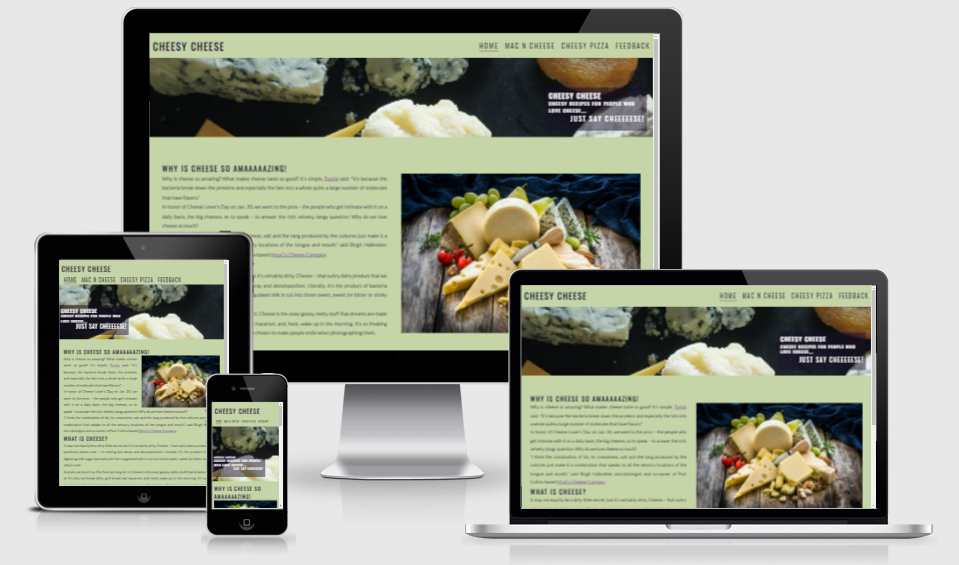
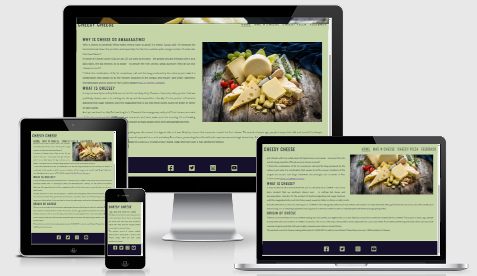
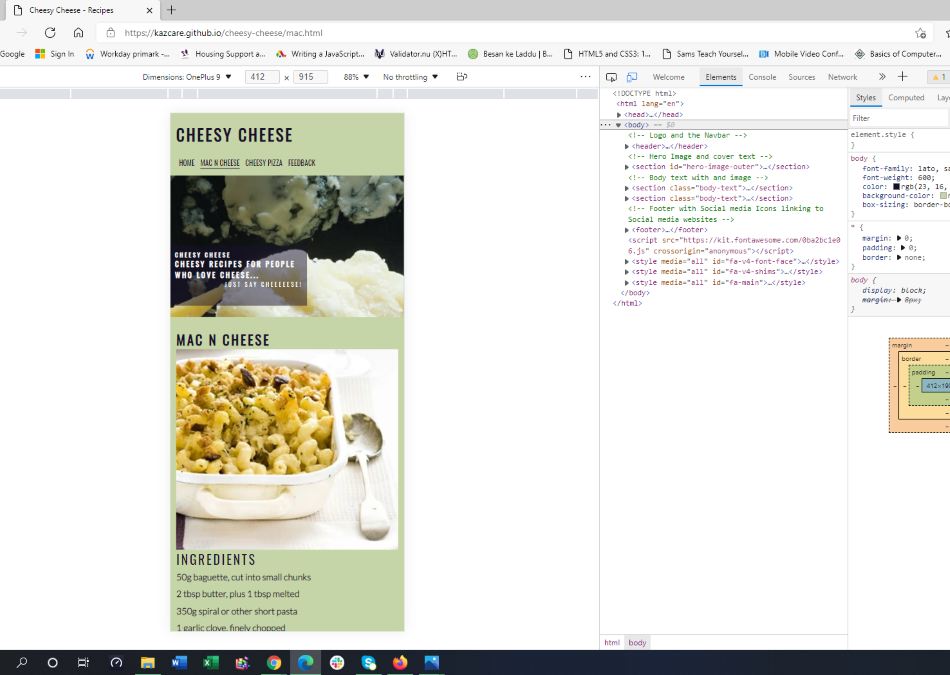

<md> 

# Cheesy Cheese

    Idea of this website to give something special to the community who love cheese alot. There are 
    already website for recipes including food with cheese in it. But I decided to make a website with the recipes of tasty, delicius and famous food made from cheese or used cheese as its main ingredient. It means every recipe in this website has cheese in it as its main ingredient.

    Many people around the work love cheese and food made from cheese, even some on them use it as 
    their regular part of daily meal. Kids love food with cheese in it and they always want something cheesy. It is a good idea to have them all in one place for their mommies. So, they don't need to go to website and look for cheesy recipes, as these are all cheesy in this website.
    
## Features

### Header/Nav Bar

    Website has a static header element with logo on the left side of the desktop page.

    Navigation bar elements are increase in size when the particular navbar element is hovered, plus the 
    nav link is underlined for the current active page.
    
    These properties and looks of the header and navbar are consistant throughout the website.

    Nav bar hanging against the logo on the right hand side, but it chages its position for smaller screen sizes. 
    But navigation links move under the logo for screen sizes 950px and smaller (for tablets). It further changes 
    its position for screen sizes 800px and smaller (for smart phones/ tablets in portrait mode)

    All pages of the website has a hero image with text overlay underneath the header and navbar area with cover 
    text on it saying what is the website about, which changes its position on screen smaller than 950px.

    The logo, nav bar and hero image on the top and footer at the bottom is consistent to all the pages. Content 
    changes between those areas. 

### Landing Page

    On home page, under the hero image it has some text including some facts about cheese and why people think 
    it is amazing, what actually cheese is and what is the origin of cheese? It has an picture on the right hand 
    side of the text, which takes over 100% of the width when screen size is reduced to 800 pixels or less.

### Recipe Pages

    There are currently 2 recipe pages available, Mac n Cheese and Cheesy Pizza.
    These recipe pages have same header and footer layout, instead of body text these have list on ingredients 
    and procedure of cooking the specific food.

    Lay out of the recipe pages are similar to each other. Both has Ingredients and Method of cooking the dish 
    with a image of the cooked dish beside it. It is responsive to smaller screen sizes same as the home page 
    and images take over 100% of the screen width for 800px or smaller screen sizes.

### Footer

    Footer contains social media icons which are linked to the corresponding external websites and it cover 
    100% of the screen width on all screen sizes. Aria label attribute is used for all the external links to 
    communicate the text to screen reader users. 

### Feedback Page

    Feedback page was designed to get cusotmer login and their feedback about the website, get the new ideas 
    from the target audience.
    It validates user's input. User's email address, username and password are required fields form instruct 
    user to input all those fields before it can be submitted. Moreover, I validates the proper email syntax 
    and incripts the password content.

## Features Left to Implement

## Testing

    This website is tested on Google Chrome, Microsoft Edge and Mozilla Firefox.

    It is responsive for different screen sizes, which is checked on all above mentioned internet browsers.

    The colour scheme used in the website is readable on all screens and browsers. 

    Forms are tested, it validates the input for different fields and submit button responds.

## Validator Testing

    No errors were detected by W3C validatol for all html files.

    No issues were indicated by W3C CSS (Jigsaw) validator css file.

    I confirmed that colours and fonts are readable.

    I used lighthouse option the Google Chrome Dev Tools to verify the website integrity. 
    

## Unfixed Bugs

## Deployment

    The website is deployed to GitHub pages, through GitHub repository

    The live link for the website can be found by clicking 
    [here](https://kazcare.github.io/cheesy-cheese/index.html)
    
## Credits

    This project is built for educational purpose only.
    
### Content

    All recipes were copied from "bbcgoodfood.com"

### media

    Image used as hero image is downloaded from "pixels.com"
    Rest of the images on the main page and recipe pages are downloaded from "istockphoto.com"

    Home icon and Social media icons were downloaded from "Font Awesome"

### Other Sources

    Idea for the feedback form was taken from "CSS Sign Up Form Tutorial" from the "freecodecamp.org" 
    with some modification.

    text overlay idea was taken from love running website.

## Other General Project Advice